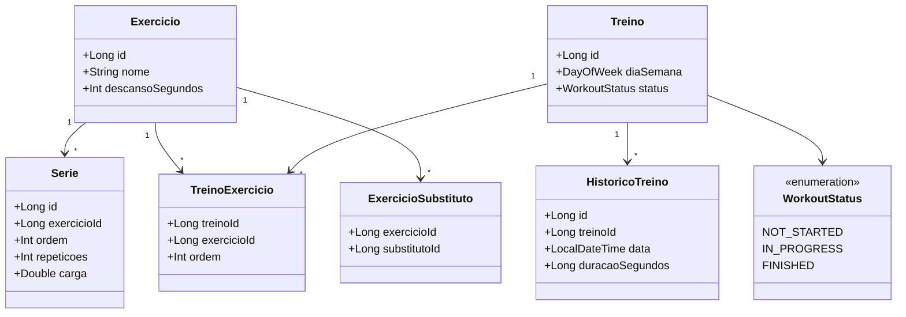

# Solo Gym

> Documento de Especificação Técnica (SRS) e Guia de Implementação para LLMs

Versão: 1.0

---

# 1. Introdução ao Projeto

## 1.1 Visão Geral

O **Solo Gym** é um aplicativo Android desenvolvido em **Kotlin** utilizando **Jetpack Compose**, cujo objetivo é auxiliar usuários no gerenciamento de seus treinos de musculação de maneira totalmente offline.

O aplicativo deve permitir que o usuário:

* Cadastre exercícios personalizados;
* Configure repetições e carga individualmente para cada série;
* Organize esses exercícios em treinos separados por dia da semana;
* Execute o treino diário;
* Acompanhe o progresso do treino em tempo real;
* Registrar o histórico de treinos realizados;
* Consultar estatísticas simples sobre frequência de treinos.
* Acompanhar level, experiência, streak e falhas por meio de um Player local.

Todo o processamento deve ocorrer localmente no dispositivo do usuário, sem qualquer dependência de serviços externos.

O aplicativo foi concebido para ser extremamente simples de utilizar, rápido e focado na experiência de treino. Não haverá funcionalidades relacionadas a redes sociais, sincronização em nuvem, autenticação de usuários ou compartilhamento de dados.

---

## 1.2 Objetivo deste documento

Este documento possui dois objetivos principais:

1. Servir como documentação técnica do projeto.
2. Servir como especificação para modelos de IA (LLMs), permitindo que o projeto seja implementado seguindo uma arquitetura consistente e previsível.

As informações aqui descritas devem ser consideradas como fonte oficial dos requisitos do projeto.

Caso alguma decisão de implementação não esteja explicitamente documentada, a solução escolhida deve priorizar:

* simplicidade;
* legibilidade;
* baixa complexidade;
* facilidade de manutenção;
* aderência às boas práticas do ecossistema Android.

---

## 1.3 Público-alvo

Este documento destina-se a:

* Desenvolvedores Android;
* Modelos de IA utilizados para geração de código;
* Revisores técnicos do projeto.

---

## 1.4 Plataforma

O projeto deverá ser desenvolvido para Android utilizando:

* Kotlin
* Jetpack Compose
* Android Studio
* Material Design 3

---

## 1.5 Tecnologias obrigatórias

A implementação deverá utilizar obrigatoriamente:

* Kotlin
* Jetpack Compose
* MVVM
* Room Database (SQLite)
* Navigation Compose
* ViewModel
* StateFlow
* Hilt (Dependency Injection)
* Coroutines
* Material 3

---

## 1.6 Tecnologias proibidas

O projeto **não deve utilizar**:

* Firebase
* Backend remoto
* APIs REST
* GraphQL
* Login de usuário
* Sincronização em nuvem
* Banco de dados online
* XML para construção de telas (utilizar apenas Compose)
* Arquiteturas diferentes de MVVM

---

## 1.7 Filosofia do projeto

O Solo Gym deve seguir alguns princípios fundamentais durante todo o desenvolvimento.

### Simplicidade

Cada funcionalidade deve existir apenas se gerar valor direto ao usuário.

Evitar telas excessivamente complexas ou fluxos desnecessários.

---

### Performance

Como todos os dados são locais, todas as operações devem ser rápidas.

O usuário nunca deve perceber lentidão ao:

* abrir o aplicativo;
* iniciar um treino;
* marcar exercícios;
* finalizar um treino;
* navegar entre telas.

---

### Persistência local

Todo o armazenamento deverá ocorrer utilizando Room.

O aplicativo deve funcionar integralmente sem conexão com a internet.

---

### Facilidade de manutenção

O código deve seguir boas práticas do Kotlin moderno.

As responsabilidades devem estar bem separadas entre:

* UI
* ViewModel
* Repository
* DAO
* Database

---

### Escalabilidade

Embora o projeto inicial seja pequeno, sua arquitetura deve permitir futuras funcionalidades sem necessidade de grandes refatorações.

Exemplos:

* cronômetro de descanso;
* registro de peso corporal;
* exportação de dados;
* backup local;
* sincronização futura (caso desejado).

Essas funcionalidades **não fazem parte do escopo atual**, mas a arquitetura deve permitir sua implementação.

---

# 2. Objetivos

## 2.1 Objetivo principal

Permitir que um usuário organize completamente sua rotina de musculação dentro de um único aplicativo simples, rápido e totalmente offline.

---

## 2.2 Objetivos específicos

O aplicativo deverá permitir que o usuário:

* cadastrar exercícios personalizados;
* configurar séries, repetições e cargas;
* definir tempo de descanso entre séries;
* configurar exercícios substitutos;
* criar treinos separados por dia da semana;
* executar o treino diário;
* acompanhar o tempo total do treino;
* marcar exercícios como concluídos;
* registrar automaticamente o histórico dos treinos realizados;
* visualizar estatísticas básicas de frequência de treino.
* acompanhar a evolução do Player por meio da conclusão assídua dos treinos.

---

## 2.3 Objetivos de experiência do usuário

A experiência do usuário deve seguir alguns princípios.

### Poucos toques

Todas as ações importantes devem exigir o menor número possível de interações.

Exemplos:

* iniciar treino em um único botão;
* finalizar treino em um único botão;
* marcar exercício como concluído com apenas um toque.

---

### Navegação intuitiva

O usuário nunca deve ficar em dúvida sobre onde encontrar determinada funcionalidade.

As principais funcionalidades deverão estar organizadas em abas.

---

### Interface limpa

A interface deve utilizar o Material Design 3, evitando excesso de informações.

Cada tela deve possuir apenas os elementos necessários.

---

### Feedback visual

Todas as ações importantes devem fornecer retorno imediato.

Exemplos:

* exercício marcado como concluído;
* treino iniciado;
* treino finalizado;
* cronômetro em execução;
* confirmação de exclusão;
* mensagens de sucesso.

---

## 2.4 Objetivos técnicos

O projeto deverá:

* utilizar arquitetura MVVM;
* seguir princípios SOLID sempre que fizer sentido;
* utilizar Repository Pattern;
* utilizar injeção de dependência com Hilt;
* utilizar Room como única fonte de dados;
* utilizar StateFlow para gerenciamento de estado;
* evitar lógica de negócio dentro das telas Compose.

---

## 2.5 Objetivos futuros (fora do escopo atual)

As funcionalidades abaixo **não devem ser implementadas nesta versão**, porém a arquitetura deve permitir sua futura adição.

* cronômetro de descanso automático;
* backup dos dados;
* exportação para CSV;
* importação de treinos;
* sincronização em nuvem;
* múltiplos usuários;
* controle de peso corporal;
* gráficos de evolução;
* modo escuro personalizado;
* widgets Android.

---

# 3. Escopo

## 3.1 O que faz parte do projeto

A versão inicial do Solo Gym deverá possuir quatro áreas principais.

### 1. Tela Inicial

Exibe o treino correspondente ao dia atual.

Caso exista um treino para aquele dia:

* mostrar lista de exercícios;
* permitir iniciar treino;
* iniciar cronômetro;
* permitir marcar exercícios concluídos;
* permitir visualizar exercícios substitutos;
* permitir finalizar o treino.

Caso não exista treino:

Exibir apenas uma mensagem semelhante a:

> "Hoje é dia de descanso."

---

### 2. Treinos

Permite:

* criar treinos;
* editar treinos;
* excluir treinos;
* associar exercícios ao treino;
* definir ordem dos exercícios;
* escolher o dia da semana correspondente.

Cada dia da semana poderá possuir **no máximo um treino**.

Não é obrigatório existir treino para todos os dias.

---

### 3. Exercícios

Permite:

* cadastrar exercícios;
* editar exercícios;
* excluir exercícios;
* definir séries;
* definir repetições por série;
* definir carga por série;
* definir descanso entre séries;
* definir exercícios substitutos.

Os exercícios cadastrados poderão ser reutilizados em diversos treinos.

---

### 4. Estatísticas

Apresenta informações obtidas a partir do histórico de treinos.

Exemplos:

* treinos realizados nesta semana;
* treinos realizados neste mês;
* treinos realizados neste ano;
* sequência atual de treinos;
* maior sequência;
* duração média dos treinos;
* tempo total treinando;
* lista dos últimos treinos realizados.

Nenhuma informação estatística dependerá de internet.

---

## 3.2 O que NÃO faz parte do projeto

As funcionalidades abaixo estão explicitamente fora do escopo.

* Cadastro de usuários
* Login
* Contas
* Compartilhamento
* Rankings
* Comunidade
* Chat
* Feed social
* Integração com smartwatches
* Integração com Google Fit
* Sincronização entre dispositivos
* Streaming
* IA para geração de treinos
* Sugestões automáticas de exercícios
* Controle de dieta
* Contagem de calorias
* Controle de hidratação
* Registro de peso corporal
* Registro de medidas
* Upload de arquivos
* Armazenamento em nuvem

Essas funcionalidades poderão ser avaliadas em versões futuras, mas não devem influenciar a implementação da primeira versão.

---

## 3.3 Definição de sucesso

A primeira versão será considerada concluída quando o usuário puder:

1. Cadastrar exercícios.
2. Configurar repetições e cargas diferentes para cada série.
3. Definir exercícios substitutos.
4. Criar treinos para qualquer dia da semana.
5. Visualizar automaticamente o treino do dia.
6. Iniciar um treino.
7. Acompanhar o tempo total do treino.
8. Marcar exercícios como concluídos.
9. Finalizar o treino.
10. Registrar automaticamente o histórico.
11. Consultar estatísticas simples de frequência de treino.

Nenhuma dessas funcionalidades deverá depender de conexão com a internet ou de qualquer serviço externo.

# 4. Requisitos Funcionais

Esta seção descreve todas as funcionalidades que deverão existir na primeira versão do Solo Gym.

Cada requisito funcional deverá ser considerado obrigatório durante a implementação.

---

## RF-01 — Cadastro de Exercícios

O aplicativo deverá permitir o cadastro de exercícios personalizados.

Cada exercício deverá possuir obrigatoriamente:

* Nome
* Tempo de descanso entre séries (em segundos)
* Lista de séries
* Repetições e carga de cada série
* Lista de exercícios substitutos (opcional)

Cada exercício deverá possuir um identificador único gerado automaticamente pelo banco de dados.

---

## RF-02 — Edição de Exercícios

O usuário poderá editar qualquer exercício previamente cadastrado.

Será permitido alterar:

* Nome
* Quantidade de séries
* Quantidade de repetições de cada série
* Carga de cada série
* Tempo de descanso
* Exercícios substitutos

As alterações deverão refletir automaticamente em todos os treinos que utilizam aquele exercício.

---

## RF-03 — Exclusão de Exercícios

O usuário poderá excluir exercícios.

Caso o exercício esteja sendo utilizado em algum treino, o aplicativo deverá impedir a exclusão e informar ao usuário que o exercício ainda faz parte de um ou mais treinos.

O usuário deverá remover o exercício dos treinos antes de excluí-lo definitivamente.

---

## RF-04 — Cadastro de Treinos

O usuário poderá criar treinos para qualquer dia da semana.

Cada treino deverá possuir:

* Dia da semana
* Lista ordenada de exercícios

Não poderão existir dois treinos para o mesmo dia da semana.

Caso o usuário tente criar outro treino para um dia já utilizado, o aplicativo deverá solicitar a edição do treino existente.

---

## RF-05 — Edição de Treinos

O usuário poderá:

* adicionar exercícios;
* remover exercícios;
* alterar a ordem dos exercícios;
* substituir exercícios.

As alterações deverão ser salvas imediatamente após confirmação do usuário.

---

## RF-06 — Exclusão de Treinos

O usuário poderá excluir qualquer treino.

A exclusão removerá apenas o treino.

Os exercícios cadastrados permanecerão armazenados.

O histórico de treinos já realizados não deverá ser removido.

---

## RF-07 — Tela Inicial

Ao abrir o aplicativo, a primeira aba deverá exibir automaticamente o treino correspondente ao dia atual.

Caso exista treino:

* mostrar todos os exercícios;
* mostrar a ordem dos exercícios;
* mostrar séries, repetições e cargas;
* mostrar tempo de descanso;
* permitir iniciar treino.

Caso não exista treino para aquele dia:

Exibir apenas uma mensagem semelhante a:

> Hoje é dia de descanso.

---

## RF-08 — Início do Treino

Ao pressionar "Iniciar Treino":

* o status do treino muda para **Em andamento**;
* inicia o cronômetro;
* todos os exercícios passam para o estado "Não concluído";
* habilita o botão para finalizar o treino.

---

## RF-09 — Marcação de Exercícios

Durante o treino, cada exercício poderá ser marcado como concluído.

Ao marcar:

* alterar o estado visual do card;
* registrar apenas durante a sessão atual;
* não persistir quais exercícios foram concluídos após finalizar o treino.

---

## RF-10 — Exercícios Substitutos

Cada exercício poderá possuir uma lista de substitutos.

Durante o treino haverá um botão "Substituições".

O botão deverá ser exibido apenas quando o exercício possuir substitutos cadastrados. Ao tocar, deverá abrir um modal com as alternativas disponíveis e uma opção para retornar ao exercício original.

Ao selecionar um exercício substituto:

* nenhuma alteração permanente será feita no treino;
* o card deverá exibir nome, séries, repetições, cargas e descanso do substituto;
* a interface deverá indicar qual exercício original está sendo substituído;
* a conclusão deverá continuar vinculada ao identificador do exercício original;
* será considerado apenas que aquele exercício foi realizado;
* o histórico não armazenará qual substituto foi utilizado.

A seleção deverá existir apenas durante a sessão atual e ser limpa ao finalizar o treino. Caso o processo seja encerrado, não será necessário restaurar o substituto selecionado.

---

## RF-11 — Finalização do Treino

Ao finalizar:

* parar o cronômetro;
* registrar a duração;
* registrar a data;
* criar um registro no histórico;
* limpar o progresso atual;
* marcar o treino como concluído para a data atual;
* impedir uma nova conclusão e uma nova recompensa no mesmo dia.

A conclusão diária deverá ser determinada pelo histórico do treino na data atual, e não por um status permanente da programação semanal.

O registro no histórico e a atualização de XP/streak do Player deverão ocorrer na mesma transação. Se o treino já estiver concluído naquela data, nenhuma nova recompensa deverá ser concedida.

---

## RF-12 — Histórico

O aplicativo deverá registrar apenas:

* data;
* duração do treino;
* treino realizado.

Não deverá registrar:

* exercícios concluídos;
* substituições utilizadas;
* pesos;
* observações.

---

## RF-13 — Estatísticas

A aba Estatísticas deverá apresentar:

* Treinos nesta semana
* Treinos neste mês
* Treinos neste ano
* Sequência atual
* Maior sequência
* Tempo médio
* Tempo total treinando
* Últimos treinos
* Level do Player
* Experiência atual e máxima
* Streak de treinos
* Falhas de treino

Todas as estatísticas deverão ser calculadas localmente.

Os dados de progressão do Player deverão ser persistidos localmente.

---

## RF-14 — Persistência

Todos os dados deverão permanecer salvos após:

* fechar o aplicativo;
* reiniciar o dispositivo;
* atualizar a interface.

---

## RF-15 — Navegação

O aplicativo deverá possuir navegação por abas.

As abas serão:

1. Hoje
2. Treinos
3. Exercícios
4. Estatísticas

---

## RF-16 — Player e Gamificação

O aplicativo deverá manter um único Player local, sem exigir cadastro, login ou autenticação.

O Player deverá possuir:

* level, inicialmente 1;
* experiência atual, inicialmente 0;
* experiência máxima, inicialmente 100;
* streak de treinos, inicialmente 0;
* falhas de treino, inicialmente 0.

Cada treino finalizado deverá conceder 20 pontos de experiência e incrementar o streak em 1.

Ao atingir a experiência máxima:

* incrementar o level em 1;
* zerar a experiência atual;
* aumentar a experiência máxima em 20%.

Uma falha ocorre quando termina um dia que possuía treino programado e não existe treino concluído naquela data. Para cada falha:

* incrementar as falhas de treino em 1;
* zerar o streak;
* descontar 10 pontos de experiência, sem permitir valor negativo.

Se o Player estiver acima do level 1 e possuir menos de 10 pontos de experiência no momento da falha:

* decrementar o level em 1;
* zerar a experiência atual;
* reduzir a experiência máxima em 20%;
* restaurar a experiência máxima para 100 ao retornar ao level 1.

O level nunca poderá ser menor que 1. Falhas sucessivas poderão reduzir o Player até level 1 com experiência atual igual a zero.

Cada data deverá ser avaliada apenas uma vez. A primeira inicialização do Player não deverá aplicar penalidades retroativas aos dias anteriores à instalação da funcionalidade.

---

# 5. Requisitos Não Funcionais

Os requisitos desta seção definem padrões de qualidade da aplicação.

---

## RNF-01 — Plataforma

O aplicativo deverá funcionar em dispositivos Android modernos compatíveis com Jetpack Compose.

---

## RNF-02 — Linguagem

Toda a implementação deverá utilizar Kotlin.

Não será permitido código Java.

---

## RNF-03 — Interface

Toda interface deverá ser construída utilizando exclusivamente Jetpack Compose.

Não utilizar XML para telas.

---

## RNF-04 — Arquitetura

A arquitetura obrigatória será MVVM.

Toda lógica de negócio deverá permanecer fora das telas Compose.

---

## RNF-05 — Persistência

Toda persistência deverá utilizar Room Database.

Não utilizar SharedPreferences para armazenar entidades da aplicação.

SharedPreferences (ou DataStore) poderá ser utilizada apenas para configurações simples da aplicação, caso sejam adicionadas futuramente.

---

## RNF-06 — Gerenciamento de Estado

Os estados da interface deverão utilizar:

* StateFlow
* MutableStateFlow
* collectAsStateWithLifecycle()

Evitar LiveData em novas implementações.

---

## RNF-07 — Programação Assíncrona

Toda operação de banco deverá utilizar:

* Kotlin Coroutines
* suspend functions

Não utilizar callbacks tradicionais.

---

## RNF-08 — Injeção de Dependência

Toda dependência deverá ser fornecida utilizando Hilt.

Não realizar instanciações manuais de Repositories ou DAOs nas telas.

---

## RNF-09 — Material Design

Toda interface deverá seguir Material Design 3.

---

## RNF-10 — Performance

Operações comuns deverão ocorrer de forma praticamente instantânea.

O usuário não deverá perceber atrasos ao:

* abrir telas;
* navegar entre abas;
* iniciar treino;
* finalizar treino;
* salvar alterações.

---

## RNF-11 — Offline

O aplicativo deverá funcionar integralmente sem conexão com a internet.

---

## RNF-12 — Código

O código deverá seguir as convenções oficiais do Kotlin.

Priorizar:

* legibilidade;
* simplicidade;
* baixo acoplamento;
* alta coesão.

---

## RNF-13 — Escalabilidade

A arquitetura deverá permitir a adição de novas funcionalidades sem necessidade de reestruturação significativa.

---

## RNF-14 — Testabilidade

Repositories e ViewModels deverão ser facilmente testáveis utilizando mocks.

---

## RNF-15 — Responsividade

Mudanças de estado deverão refletir imediatamente na interface utilizando Compose.

Não deverá existir necessidade de atualizar telas manualmente.

---

# 6. Stack Tecnológica

A implementação deverá utilizar exclusivamente as tecnologias abaixo.

| Camada                 | Tecnologia         |
| ---------------------- | ------------------ |
| Linguagem              | Kotlin             |
| UI                     | Jetpack Compose    |
| Design                 | Material Design 3  |
| Navegação              | Navigation Compose |
| Arquitetura            | MVVM               |
| Banco de Dados         | Room               |
| Banco Físico           | SQLite             |
| Concorrência           | Kotlin Coroutines  |
| Estado                 | StateFlow          |
| Injeção de Dependência | Hilt               |
| Build                  | Gradle Kotlin DSL  |

---

## Organização da arquitetura

A aplicação deverá seguir o fluxo abaixo.

```text
UI (Compose)

↓

ViewModel

↓

Repository

↓

DAO

↓

Room Database (SQLite)
```

A comunicação deverá ocorrer apenas entre camadas adjacentes.

---

## Comunicação entre camadas

A UI nunca deverá acessar diretamente:

* Room
* DAO
* Database

A UI deverá conversar apenas com a ViewModel.

---

A ViewModel nunca deverá conhecer detalhes da implementação do banco.

Ela deverá depender apenas dos Repositories.

---

Os Repositories serão responsáveis por:

* leitura;
* escrita;
* atualização;
* remoção;
* agregação de consultas;
* encapsulamento da fonte de dados.

---

## Gerenciamento de estado

Cada tela deverá possuir sua própria ViewModel.

A UI deverá observar StateFlows expostos pela ViewModel.

Sempre que possível, utilizar um único objeto de estado (`UiState`) por tela, contendo todas as informações necessárias para renderização.

---

## Organização do banco

Todas as entidades deverão ser armazenadas em um único banco Room.

O banco deverá possuir versionamento desde a primeira versão para facilitar futuras migrações.

---

## Dependências recomendadas

A implementação deverá utilizar versões estáveis e recentes das seguintes bibliotecas:

* AndroidX Compose
* Material3
* Navigation Compose
* Lifecycle Runtime Compose
* Room
* Hilt
* Hilt Navigation Compose
* Kotlin Coroutines
* Kotlin Serialization (caso seja necessária futuramente)
* Timber (opcional para logs durante desenvolvimento)

Evitar bibliotecas desnecessárias que aumentem a complexidade do projeto.

O projeto deve permanecer leve, simples e de fácil manutenção.

# 7. Estrutura de Pastas

O projeto deverá seguir uma organização baseada em **feature-first**, mantendo cada funcionalidade isolada e de fácil manutenção.

A estrutura sugerida é:

```text
com.sologym
│
├── MainActivity.kt
├── SoloGymApplication.kt
│
├── di/
│   ├── DatabaseModule.kt
│   ├── RepositoryModule.kt
│   └── ViewModelModule.kt
│
├── navigation/
│   ├── Navigation.kt
│   ├── BottomNavigation.kt
│   ├── Destinations.kt
│   └── Routes.kt
│
├── database/
│   ├── SoloGymDatabase.kt
│   │
│   ├── dao/
│   ├── entity/
│   ├── relation/
│   └── converter/
│
├── repository/
│   ├── ExerciseRepository.kt
│   ├── WorkoutRepository.kt
│   ├── StatisticsRepository.kt
│   └── HistoryRepository.kt
│
├── model/
│
├── ui/
│   │
│   ├── theme/
│   │
│   ├── components/
│   │
│   ├── home/
│   │   ├── HomeScreen.kt
│   │   ├── HomeViewModel.kt
│   │   ├── HomeUiState.kt
│   │   └── components/
│   │
│   ├── workouts/
│   │   ├── WorkoutScreen.kt
│   │   ├── WorkoutViewModel.kt
│   │   ├── WorkoutUiState.kt
│   │   └── components/
│   │
│   ├── exercises/
│   │   ├── ExerciseScreen.kt
│   │   ├── ExerciseViewModel.kt
│   │   ├── ExerciseUiState.kt
│   │   └── components/
│   │
│   ├── statistics/
│   │   ├── StatisticsScreen.kt
│   │   ├── StatisticsViewModel.kt
│   │   ├── StatisticsUiState.kt
│   │   └── components/
│   │
│   └── common/
│
├── util/
│
└── extensions/
```

---

## Organização das responsabilidades

### UI

Responsável apenas por:

* renderizar a interface;
* observar estados;
* enviar eventos para a ViewModel.

A UI nunca deverá acessar o banco de dados diretamente.

---

### ViewModel

Responsável por:

* controlar estado da tela;
* receber eventos da UI;
* chamar Repositories;
* preparar dados para exibição.

A ViewModel nunca deverá conhecer Room ou DAOs.

---

### Repository

Responsável por:

* encapsular acesso ao banco;
* combinar consultas;
* executar regras simples de persistência.

---

### DAO

Responsável apenas pelas consultas SQL.

Não implementar regras de negócio nos DAOs.

---

### Database

Responsável por registrar:

* entidades;
* DAOs;
* migrations futuras.

---

### Components

Toda interface reutilizável deverá ficar em:

```text
ui/components
```

Exemplos:

* ExerciseCard
* WorkoutCard
* TimerCard
* StatisticCard
* EmptyState
* ConfirmationDialog
* TopBar

Evitar componentes muito específicos fora de suas respectivas features.

---

# 8. Fluxo de Navegação

O aplicativo utilizará uma navegação simples baseada em Bottom Navigation.

As quatro abas principais serão:

```text
Hoje

↓

Treinos

↓

Exercícios

↓

Estatísticas
```

A aba **Hoje** será sempre a tela inicial do aplicativo.

---

## Fluxo geral

```text
Splash (opcional)

↓

Tela Principal

↓

Bottom Navigation

├── Hoje
├── Treinos
├── Exercícios
└── Estatísticas
```

---

## Fluxo da aba Hoje

```text
Abrir aplicativo

↓

Consultar treino do dia

↓

Existe treino?

├── Não
│
│   Mostrar:
│   "Hoje é dia de descanso."
│
└── Sim
    │
    Mostrar treino
    │
    Iniciar treino
    │
    Cronômetro inicia
    │
    Marcar exercícios
    │
    Finalizar treino
    │
    Salvar histórico
```

---

## Fluxo da aba Treinos

```text
Lista de treinos

↓

Selecionar treino

↓

Editar treino

↓

Salvar
```

ou

```text
Lista

↓

Novo treino

↓

Selecionar dia

↓

Adicionar exercícios

↓

Salvar
```

---

## Fluxo da aba Exercícios

```text
Lista

↓

Novo exercício

↓

Cadastrar

↓

Salvar
```

ou

```text
Lista

↓

Editar exercício

↓

Salvar
```

ou

```text
Lista

↓

Excluir

↓

Confirmação

↓

Excluir definitivamente
```

---

## Fluxo da aba Estatísticas

```text
Abrir tela

↓

Consultar histórico

↓

Calcular indicadores

↓

Exibir cartões
```

---

## Navegação secundária

Além das quatro abas, o aplicativo poderá abrir telas auxiliares.

Exemplos:

* Cadastro de exercício
* Editar exercício
* Cadastro de treino
* Editar treino
* Seleção de substitutos

Essas telas deverão ser abertas utilizando Navigation Compose.

---

## Retorno

Sempre que possível:

Salvar alterações

↓

Retornar automaticamente para a tela anterior.

Evitar etapas intermediárias desnecessárias.

---

# 9. Especificação das Telas

## 9.1 Tela Inicial (Hoje)

Objetivo:

Apresentar ao usuário o treino correspondente ao dia atual.

---

### Componentes

Topo:

* saudação simples (opcional);
* data atual.

Conteúdo:

Caso exista treino:

* Card com informações do treino;
* Cronômetro;
* Lista de exercícios;
* Botão "Iniciar Treino";
* Botão "Finalizar Treino".

Caso não exista treino:

* Ícone ilustrativo;
* Texto:

> Hoje é dia de descanso.

---

### Card do exercício

Cada exercício deverá exibir:

* Nome
* Séries
* Repetições
* Carga de cada série
* Descanso
* Botão "Substituições"
* Checkbox de concluído

Quando concluído:

* reduzir destaque visual;
* exibir indicador de concluído.

---

### Cronômetro

Após iniciar o treino deverá mostrar:

```text
00:00:00
```

Atualização visual:

Uma vez por segundo.

A duração deverá ser calculada pela diferença entre o instante monotônico de início e o instante atual, e não pela quantidade de atualizações executadas. O bloqueio da tela, a suspensão temporária do processo ou o uso do aplicativo em segundo plano não deverão reduzir o tempo contabilizado.

Ao finalizar, a duração deverá ser recalculada diretamente pelo relógio monotônico antes de ser gravada no histórico.

---

## 9.2 Tela Treinos

Objetivo:

Gerenciar os treinos da semana.

---

### Lista

Cada card deverá mostrar:

* Dia da semana
* Quantidade de exercícios

Ao tocar:

Abrir edição.

---

### FAB

Botão flutuante:

Adicionar treino.

---

### Cadastro

Campos:

* Dia da semana
* Lista de exercícios

O usuário poderá:

* adicionar;
* remover;
* reordenar exercícios.

---

## 9.3 Tela Exercícios

Objetivo:

Cadastrar exercícios reutilizáveis.

---

### Lista

Cada card deverá mostrar:

* Nome
* Quantidade de séries
* Descanso

---

### FAB

Adicionar exercício.

---

### Cadastro

Campos:

Nome

Lista de séries

Exemplo:

```text
Série 1

12 repetições — 20 kg

+

Série 2

10 repetições — 25 kg

+

Série 3

8 repetições — 30 kg
```

Campo:

Tempo de descanso.

Campo:

Exercícios substitutos.

Botão:

Salvar.

---

## Seleção de substitutos

Ao editar um exercício:

Mostrar lista de exercícios cadastrados.

O usuário poderá marcar vários substitutos.

Não permitir que um exercício seja substituto dele próprio.

---

## 9.4 Tela Estatísticas

Objetivo:

Exibir indicadores do histórico de treinos.

Exibir também o progresso persistente do Player.

---

### Cards

O card principal do Player deverá mostrar:

* level;
* experiência atual e máxima;
* barra de progresso da experiência;
* streak atual;
* total de falhas.

---

Treinos da semana

Treinos do mês

Treinos do ano

---

Sequência atual

Maior sequência

---

Tempo médio

Tempo total treinando

---

Últimos treinos

Lista simples contendo:

* Data
* Duração

Exemplo:

```text
05/07/2026

01h18min
```

---

### Estado vazio

Caso não exista histórico:

Mostrar:

* ícone;
* mensagem;

> Nenhum treino realizado ainda.

---

## Estados das telas

Todas as telas deverão suportar quatro estados básicos.

### Loading

Enquanto os dados são carregados.

---

### Conteúdo

Estado normal.

---

### Vazio

Quando não existirem dados.

Exemplos:

* nenhum treino;
* nenhum exercício;
* nenhum histórico.

---

### Erro

Embora improvável por ser um aplicativo offline, erros de banco de dados deverão ser tratados com uma mensagem amigável ao usuário, permitindo nova tentativa sem encerrar o aplicativo.

---

## Consistência visual

Todas as telas deverão seguir o mesmo padrão de interface.

Elementos reutilizáveis deverão possuir aparência consistente.

Exemplos:

* mesmo estilo de cards;
* mesmos botões;
* mesmas animações;
* mesmo espaçamento;
* mesma tipografia;
* mesmas cores definidas pelo tema Material 3.

O usuário deve perceber que todas as telas fazem parte de um único produto, evitando variações visuais desnecessárias.

# 10. Modelo de Dados

Esta seção define todas as entidades utilizadas pelo aplicativo.

A modelagem foi projetada para ser totalmente compatível com Room Database e seguir boas práticas de bancos relacionais.

Não deverão existir listas de IDs armazenadas diretamente nas entidades principais. Todos os relacionamentos deverão utilizar tabelas intermediárias.

---

# 10.1 Entidade: Exercicio

Representa um exercício que poderá ser reutilizado em diversos treinos.

## Atributos

| Campo            | Tipo   | Obrigatório | Descrição                      |
| ---------------- | ------ | ----------- | ------------------------------ |
| id               | Long   | Sim         | Identificador único            |
| nome             | String | Sim         | Nome do exercício              |
| descansoSegundos | Int    | Sim         | Tempo de descanso entre séries |

---

## Regras

* O nome não poderá ser vazio.
* O nome deverá possuir no máximo 100 caracteres.
* O descanso deverá ser maior que zero.
* Um exercício deverá possuir pelo menos uma série.

---

# 10.2 Entidade: Serie

Representa uma série pertencente a um exercício.

## Atributos

| Campo       | Tipo   | Obrigatório | Descrição                                      |
| ----------- | ------ | ----------- | ---------------------------------------------- |
| id          | Long   | Sim         | Identificador único                            |
| exercicioId | Long   | Sim         | Exercício ao qual a série pertence             |
| ordem       | Int    | Sim         | Posição da série no exercício                  |
| repeticoes  | Int    | Sim         | Quantidade de repetições                       |
| carga       | Double | Sim         | Carga da série em quilogramas; padrão igual a 0 |

---

## Exemplo

Supino

| Ordem | Repetições | Carga (kg) |
| ----- | ---------- | ---------- |
| 1     | 12         | 20         |
| 2     | 10         | 25         |
| 3     | 8          | 30         |
| 4     | 8          | 30         |

---

## Regras

* A ordem deverá iniciar em 1.
* Não poderão existir duas séries com a mesma ordem para o mesmo exercício.
* A quantidade mínima de repetições é 1.
* A carga deverá ser maior ou igual a zero e poderá ser diferente em cada série.
* Séries existentes antes da inclusão deste campo deverão receber carga igual a zero durante a migração do banco.

---

# 10.3 Entidade: Treino

Representa um treino de um dia específico da semana.

## Atributos

| Campo     | Tipo          |
| --------- | ------------- |
| id        | Long          |
| diaSemana | DayOfWeek     |
| status    | WorkoutStatus |

---

## Regras

* Apenas um treino por dia da semana.
* O treino deverá possuir pelo menos um exercício.

---

# 10.4 Entidade: TreinoExercicio

Tabela de relacionamento entre Treino e Exercício.

## Atributos

| Campo       | Tipo |
| ----------- | ---- |
| treinoId    | Long |
| exercicioId | Long |
| ordem       | Int  |

---

## Regras

A coluna ordem define a sequência de execução dos exercícios.

---

# 10.5 Entidade: ExercicioSubstituto

Relacionamento N:N entre exercícios.

## Atributos

| Campo        | Tipo |
| ------------ | ---- |
| exercicioId  | Long |
| substitutoId | Long |

---

## Regras

Um exercício:

* pode possuir nenhum substituto;
* pode possuir vários substitutos;
* nunca poderá ser substituto dele próprio.

---

# 10.6 Entidade: HistoricoTreino

Representa um treino concluído.

## Atributos

| Campo           | Tipo          |
| --------------- | ------------- |
| id              | Long          |
| treinoId        | Long          |
| data            | LocalDateTime |
| duracaoSegundos | Long          |

---

## Regras

O histórico deverá ser criado apenas quando o treino for finalizado.

Nenhuma informação sobre exercícios concluídos deverá ser armazenada.

---

# 10.7 Entidade: Player

Representa o único usuário local e sua progressão de gamificação.

## Atributos

| Campo                | Tipo      | Valor inicial | Descrição                                      |
| -------------------- | --------- | ------------- | ---------------------------------------------- |
| id                   | Int       | 1             | Identificador fixo do Player local             |
| level                | Int       | 1             | Nível atual                                    |
| experienciaAtual     | Int       | 0             | Experiência acumulada no nível                 |
| experienciaMaxima    | Int       | 100           | Experiência necessária para o próximo nível    |
| streakTreinos        | Int       | 0             | Sequência de treinos concluídos                |
| falhasTreino         | Int       | 0             | Quantidade de dias programados não realizados  |
| proximaDataFalha     | LocalDate | Data atual    | Controle interno para evitar falhas duplicadas |

## Regras

* Deverá existir somente um Player.
* A experiência atual nunca poderá ser negativa e o level nunca poderá ser menor que 1.
* Uma falha com XP insuficiente deverá reduzir um level quando o Player estiver acima do level 1.
* A progressão deverá ser atualizada ao finalizar um treino.
* A avaliação de falhas deverá considerar somente datas anteriores ao dia atual.
* Dias sem treino programado não deverão gerar falhas.

---

# 10.8 Entidade: ActiveWorkoutSession

Representa a única sessão de treino atualmente em andamento.

## Atributos

| Campo                | Tipo | Descrição                                      |
| -------------------- | ---- | ---------------------------------------------- |
| id                   | Int  | Identificador fixo igual a 1                   |
| workoutId            | Long | Treino que está sendo executado                |
| startedAtEpochMillis | Long | Instante de início persistido em epoch millis  |

## Regras

* Deverá existir no máximo uma sessão ativa.
* A sessão deverá ser criada antes de iniciar a contagem visual.
* A sessão deverá sobreviver ao encerramento do processo e à reinicialização do aparelho.
* Ao restaurar, a duração deverá considerar todo o tempo transcorrido desde `startedAtEpochMillis`.
* A sessão deverá ser removida na mesma transação que grava o histórico e atualiza o Player.
* Uma sessão ativa iniciada em um dia programado impede que esse dia seja contabilizado como falha enquanto o treino não for finalizado.

---

# 10.9 Enum: WorkoutStatus

Representa o estado atual do treino.

Valores possíveis:

```text
NOT_STARTED

IN_PROGRESS

FINISHED
```

Observação:

O estado **FINISHED** representa apenas a finalização da sessão atual.

Após salvar o histórico, o treino deverá voltar automaticamente para **NOT_STARTED**, garantindo que no dia seguinte o usuário possa iniciar um novo treino normalmente.

---

# 11. Diagrama de Classes (Mermaid)



---

# 12. Estrutura do Banco Room

## Banco

Nome:

```text
solo_gym.db
```

Versão inicial:

```text
1
```

---

## Entidades registradas

O banco deverá registrar as seguintes entidades:

```kotlin
Exercicio

Serie

Treino

TreinoExercicio

ExercicioSubstituto

HistoricoTreino
```

---

## DAOs

O banco deverá possuir um DAO para cada agregação principal.

### ExerciseDao

Responsável por:

* inserir exercício;
* atualizar exercício;
* excluir exercício;
* consultar exercício por ID;
* listar exercícios;
* pesquisar por nome.

---

### WorkoutDao

Responsável por:

* inserir treino;
* atualizar treino;
* excluir treino;
* consultar treino por dia;
* listar treinos;
* alterar status.

---

### WorkoutExerciseDao

Responsável por:

* adicionar exercícios ao treino;
* remover exercícios;
* atualizar ordem;
* listar exercícios do treino.

---

### SeriesDao

Responsável por:

* inserir séries;
* atualizar séries;
* excluir séries;
* consultar séries de um exercício.

---

### SubstituteDao

Responsável por:

* adicionar substitutos;
* remover substitutos;
* listar substitutos.

---

### HistoryDao

Responsável por:

* inserir histórico;
* listar histórico;
* consultar histórico por período;
* calcular estatísticas.

---

# Relações Room

As consultas complexas deverão utilizar @Relation sempre que possível.

Exemplos:

## Exercício completo

```text
Exercicio

↓

Lista de séries

↓

Lista de substitutos
```

---

## Treino completo

```text
Treino

↓

Lista ordenada de exercícios

↓

Cada exercício

↓

Lista de séries
```

---

## Objetos agregados

Recomenda-se criar classes específicas de relacionamento para facilitar consultas.

Exemplos:

```kotlin
ExerciseWithSeries

ExerciseWithSubstitutes

WorkoutWithExercises

CompleteWorkout

WorkoutHistoryWithWorkout
```

Essas classes não representam tabelas do banco.

Servirão apenas para facilitar consultas do Room.

---

# Versionamento

O banco deverá iniciar na versão:

```text
Version = 1
```

Todas as futuras alterações deverão utilizar Migrations.

Não utilizar fallbackToDestructiveMigration() em versões destinadas à produção.

---

# Índices

Criar índices para melhorar consultas frequentes.

Recomenda-se:

* nome do exercício;
* dia da semana;
* data do histórico.

---

# Chaves estrangeiras

Todas as tabelas relacionais deverão utilizar Foreign Keys.

Excluir registros relacionados utilizando CASCADE apenas quando fizer sentido.

Exemplo:

Excluir um exercício deverá remover:

* suas séries;
* seus relacionamentos de substituição.

Entretanto, não deverá ser permitido excluir um exercício que ainda esteja associado a algum treino.

Essa validação deverá ocorrer na camada de Repository antes da operação de exclusão.

---

# Integridade

O banco deverá garantir:

* inexistência de treinos duplicados para o mesmo dia;
* inexistência de séries duplicadas na mesma posição;
* inexistência de relacionamentos inválidos;
* inexistência de substituição para o próprio exercício;
* consistência entre todas as chaves estrangeiras.

A integridade dos dados é considerada requisito obrigatório da aplicação.

# 13. Data Access Objects (DAOs)

Esta seção define as responsabilidades de cada DAO e os contratos esperados. A implementação deverá manter os DAOs o mais simples possível, limitando-se ao acesso aos dados.

Nenhuma regra de negócio deverá ser implementada diretamente nos DAOs.

---

## 13.1 ExerciseDao

Responsável pelo gerenciamento da entidade **Exercicio**.

### Operações

* Inserir exercício
* Atualizar exercício
* Excluir exercício
* Buscar por ID
* Listar todos os exercícios
* Pesquisar por nome
* Verificar existência de exercício

---

## 13.2 SeriesDao

Responsável pela entidade **Serie**.

### Operações

* Inserir série
* Inserir múltiplas séries
* Atualizar série
* Remover série
* Remover todas as séries de um exercício
* Buscar séries de um exercício
* Buscar séries ordenadas

---

## 13.3 WorkoutDao

Responsável pela entidade **Treino**.

### Operações

* Inserir treino
* Atualizar treino
* Excluir treino
* Buscar treino por ID
* Buscar treino pelo dia da semana
* Listar todos os treinos
* Verificar existência de treino para determinado dia

---

## 13.4 WorkoutExerciseDao

Responsável pelo relacionamento entre treino e exercício.

### Operações

* Adicionar exercício ao treino
* Remover exercício do treino
* Atualizar ordem dos exercícios
* Buscar exercícios pertencentes a um treino
* Remover todos os exercícios de um treino

---

## 13.5 SubstituteDao

Responsável pelos exercícios substitutos.

### Operações

* Adicionar substituto
* Remover substituto
* Buscar substitutos
* Remover todos os substitutos de um exercício

---

## 13.6 HistoryDao

Responsável pelo histórico de treinos.

### Operações

* Inserir histórico
* Buscar histórico completo
* Buscar histórico por intervalo de datas
* Buscar últimos treinos
* Contar treinos
* Calcular tempo total treinado

---

## Boas práticas

Todos os métodos deverão ser:

* `suspend`, quando apropriado;
* pequenos;
* específicos;
* reutilizáveis.

Consultas complexas deverão utilizar objetos de relacionamento (`@Relation`) em vez de SQL excessivamente elaborado.

---

# 14. Repositories

Os Repositories serão responsáveis por centralizar toda a lógica de acesso aos dados e implementar as regras de negócio da camada de persistência.

A UI nunca deverá acessar um DAO diretamente.

---

## 14.1 ExerciseRepository

Responsabilidades:

* cadastrar exercício;
* editar exercício;
* excluir exercício;
* validar nome;
* gerenciar séries;
* gerenciar substitutos.

### Regras

Antes de excluir um exercício deverá verificar se ele pertence a algum treino.

Caso pertença, lançar erro apropriado para a ViewModel tratar.

---

## 14.2 WorkoutRepository

Responsabilidades:

* criar treino;
* editar treino;
* excluir treino;
* buscar treino do dia;
* listar treinos.

### Regras

Ao criar um treino:

* verificar se já existe treino para aquele dia;
* impedir duplicidade.

Ao salvar:

* atualizar também a ordem dos exercícios.

---

## 14.3 HistoryRepository

Responsabilidades:

* registrar treino finalizado;
* consultar histórico;
* consultar histórico recente.

### Regras

Registrar apenas:

* data;
* duração;
* treino realizado.

Não registrar progresso dos exercícios.

---

## 14.4 StatisticsRepository

Responsabilidades:

Calcular todas as métricas da tela de estatísticas.

Exemplos:

* treinos na semana;
* treinos no mês;
* treinos no ano;
* sequência atual;
* maior sequência;
* duração média;
* tempo total.

As métricas deverão ser calculadas dinamicamente a partir do histórico.

Não armazenar valores agregados no banco.

---

## Transações

Operações que modificam várias tabelas deverão utilizar transações.

Exemplos:

Criar exercício:

```text id="c84m0j"
Inserir exercício

↓

Inserir séries

↓

Inserir substitutos
```

Caso alguma etapa falhe:

Toda a operação deverá ser revertida.

---

Editar treino:

```text id="ukydrz"
Atualizar treino

↓

Atualizar lista de exercícios

↓

Atualizar ordem
```

Tudo deverá ocorrer na mesma transação.

---

Finalizar treino:

```text id="owqvjl"
Criar histórico

↓

Persistir duração

↓

Concluir operação
```

---

## Tratamento de erros

Repositories não deverão exibir mensagens para o usuário.

Eles deverão:

* lançar exceções específicas; ou
* retornar um tipo de resultado (por exemplo, `Result<T>`).

A decisão deve ser uniforme em todo o projeto.

Recomenda-se utilizar `Result<T>` para operações de escrita e `Flow` para consultas reativas.

---

# 15. ViewModels

Cada tela principal deverá possuir uma ViewModel própria.

As ViewModels serão responsáveis por:

* controlar o estado da interface;
* responder às ações do usuário;
* comunicar-se com os Repositories;
* expor um único estado observável para a UI.

---

## Organização

Cada ViewModel deverá possuir:

```text id="ydjlwm"
UiState

↓

Eventos

↓

Funções públicas

↓

Chamadas aos Repositories
```

---

## HomeViewModel

Responsável pela tela "Hoje".

### Responsabilidades

* identificar o dia atual;
* buscar o treino correspondente;
* iniciar treino;
* controlar cronômetro;
* marcar exercícios como concluídos;
* finalizar treino;
* registrar histórico.

### Eventos esperados

* Iniciar treino
* Finalizar treino
* Marcar exercício
* Abrir substitutos

---

## WorkoutViewModel

Responsável pela aba Treinos.

### Responsabilidades

* carregar treinos;
* criar treino;
* editar treino;
* excluir treino;
* ordenar exercícios.

---

## ExerciseViewModel

Responsável pela aba Exercícios.

### Responsabilidades

* listar exercícios;
* cadastrar;
* editar;
* excluir;
* pesquisar;
* gerenciar substitutos.

---

## StatisticsViewModel

Responsável pela aba Estatísticas.

### Responsabilidades

* carregar indicadores;
* calcular estatísticas;
* atualizar automaticamente quando o histórico mudar.

---

## Estados (UiState)

Cada tela deverá possuir um único objeto de estado.

Exemplo:

```kotlin id="b7v9d2"
data class HomeUiState(...)
```

O estado deverá conter tudo o que a tela precisa para ser renderizada.

Evitar múltiplos `StateFlow` independentes para informações relacionadas.

---

## Eventos

As ações da interface deverão ser representadas por eventos.

Exemplo conceitual:

```text id="jlwmvq"
Usuário toca botão

↓

Evento

↓

ViewModel

↓

Repository

↓

Novo estado

↓

Compose recompõe a tela
```

---

## Cronômetro

O cronômetro deverá ser controlado exclusivamente pela `HomeViewModel`.

A interface apenas exibirá o tempo atual.

O cronômetro deverá atualizar o estado uma vez por segundo.

---

## Tratamento de erros

Cada ViewModel deverá converter erros técnicos em mensagens amigáveis para a interface.

A UI não deverá conhecer exceções do banco de dados.

---

## Ciclo de vida

As ViewModels deverão sobreviver às recomposições da interface.

Toda lógica de negócio deverá permanecer nelas.

Nenhuma regra de negócio deverá ser implementada diretamente em Composables.

---

## Comunicação com a UI

A comunicação deverá ocorrer preferencialmente por meio de:

* `StateFlow` para estado contínuo;
* `SharedFlow` ou `Channel` para eventos de uso único (snackbars, navegação, diálogos, mensagens de erro).

Isso evita que eventos sejam disparados novamente após mudanças de configuração ou recomposição da interface.

---

## Observação arquitetural importante

Os exercícios marcados como concluídos permanecem apenas na `HomeViewModel`. Entretanto, a identificação do treino ativo e seu instante de início fazem parte do modelo persistente por meio de `ActiveWorkoutSession`.

O valor visual do cronômetro deverá ser calculado na `HomeViewModel`, mas os dados mínimos para reconstruí-lo deverão permanecer no Room até a finalização.

Ao finalizar o treino, apenas um registro será criado na entidade `HistoricoTreino`.

Após o registro do histórico:

* todos os exercícios voltarão ao estado de não concluídos;
* o cronômetro será reiniciado;
* a tela ficará pronta para uma nova execução do treino.

Essa separação entre **estado persistente** e **estado da interface** deverá ser preservada durante toda a implementação.

# 16. Casos de Uso

Esta seção descreve os principais fluxos de utilização do Solo Gym.

Os casos de uso representam o comportamento esperado da aplicação e deverão ser utilizados como referência durante a implementação.

---

# UC-01 — Cadastrar Exercício

## Ator

Usuário

## Pré-condições

Nenhuma.

## Fluxo principal

1. Usuário acessa a aba **Exercícios**.
2. Pressiona o botão **Adicionar**.
3. Informa o nome do exercício.
4. Adiciona uma ou mais séries.
5. Define o tempo de descanso.
6. Opcionalmente escolhe exercícios substitutos.
7. Pressiona **Salvar**.
8. O sistema valida os dados.
9. O exercício é salvo.
10. O usuário retorna automaticamente para a lista de exercícios.

## Fluxos alternativos

### Nome vazio

O sistema deverá impedir o salvamento.

---

### Nenhuma série cadastrada

O sistema deverá impedir o salvamento.

---

### Descanso inválido

O sistema deverá impedir o salvamento.

---

## Pós-condições

O exercício ficará disponível para utilização em qualquer treino.

---

# UC-02 — Criar Treino

## Ator

Usuário

## Pré-condições

Existir pelo menos um exercício cadastrado.

## Fluxo principal

1. Acessar a aba Treinos.
2. Pressionar **Adicionar Treino**.
3. Escolher o dia da semana.
4. Selecionar exercícios.
5. Definir a ordem dos exercícios.
6. Salvar.

## Fluxos alternativos

### Dia já utilizado

O sistema deverá impedir o cadastro e informar que já existe um treino para esse dia.

---

### Nenhum exercício selecionado

O sistema deverá impedir o salvamento.

---

## Pós-condições

O treino passa a aparecer na lista de treinos.

Caso corresponda ao dia atual, também será exibido na aba **Hoje**.

---

# UC-03 — Editar Treino

## Fluxo

1. Abrir lista de treinos.
2. Selecionar treino.
3. Alterar exercícios.
4. Alterar ordem.
5. Salvar.

---

## Pós-condições

As alterações ficam imediatamente disponíveis.

---

# UC-04 — Executar Treino

## Pré-condições

Existir treino para o dia atual.

## Fluxo principal

1. Abrir aplicativo.
2. Visualizar treino do dia.
3. Pressionar **Iniciar Treino**.
4. Cronômetro inicia.
5. Usuário realiza os exercícios.
6. Marca cada exercício como concluído.
7. Pressiona **Finalizar Treino**.

---

## Pós-condições

O histórico recebe um novo registro.

---

# UC-05 — Utilizar Exercício Substituto

## Fluxo

1. Abrir treino.
2. Selecionar exercício.
3. Abrir lista de substitutos.
4. Escolher um substituto.
5. Executar o substituto.
6. Marcar exercício como concluído.

---

## Observação

A escolha do substituto não altera permanentemente o treino.

---

# UC-06 — Consultar Estatísticas

## Fluxo

1. Abrir aba Estatísticas.
2. Sistema avalia falhas de treino ainda não processadas.
3. Sistema consulta o Player e o histórico.
4. Calcula indicadores.
5. Exibe progresso e informações.

---

# UC-07 — Excluir Exercício

## Fluxo

1. Abrir lista.
2. Selecionar exercício.
3. Pressionar excluir.

---

## Fluxo alternativo

Caso o exercício pertença a algum treino:

* cancelar exclusão;
* informar motivo ao usuário.

---

# UC-08 — Excluir Treino

## Fluxo

1. Abrir treino.
2. Pressionar excluir.
3. Confirmar.
4. Sistema remove o treino.

---

## Pós-condições

Os exercícios permanecem cadastrados.

---

# 17. Estados das Telas

Todas as telas deverão possuir estados previsíveis e totalmente controlados pela respectiva ViewModel.

A UI nunca deverá manter estado de negócio.

---

# HomeUiState

A tela inicial deverá possuir um estado semelhante ao seguinte:

```text id="1c5n7d"
isLoading

todayWorkout

isWorkoutRunning

elapsedTime

completedExercises

error

showFinishDialog
```

---

## Estados possíveis

### Carregando

Enquanto o treino do dia está sendo consultado.

---

### Sem treino

Mostrar:

> Hoje é dia de descanso.

---

### Treino disponível

Exibir:

* cronômetro;
* lista de exercícios;
* botão iniciar.

---

### Treino em andamento

Exibir:

* cronômetro ativo;
* exercícios concluídos;
* botão finalizar.

---

### Erro

Exibir mensagem amigável.

---

# ExerciseUiState

Campos sugeridos:

```text id="0nshrk"
isLoading

exerciseList

searchText

showDeleteDialog

error
```

---

# WorkoutUiState

Campos sugeridos:

```text id="x2v6q0"
isLoading

workouts

selectedWorkout

error
```

---

# StatisticsUiState

Campos sugeridos:

```text id="kkr1hg"
isLoading

statistics

lastWorkouts

error
```

---

## Eventos temporários

Eventos que não representam estado deverão utilizar SharedFlow ou Channel.

Exemplos:

* Snackbar
* Navegação
* Confirmação
* Mensagens de erro

Esses eventos não deverão permanecer armazenados no UiState.

---

# Estado vazio

Sempre que uma lista estiver vazia deverá existir um componente visual específico.

Exemplos:

Nenhum exercício cadastrado.

Nenhum treino cadastrado.

Nenhum histórico disponível.

Hoje é dia de descanso.

---

# Estado de carregamento

Durante operações longas deverão ser exibidos indicadores visuais.

Como a aplicação é local, o carregamento normalmente será muito rápido, mas o comportamento deverá existir para manter consistência.

---

# 18. Regras de Negócio

Esta seção define as regras obrigatórias da aplicação.

Essas regras possuem prioridade sobre qualquer decisão de implementação.

---

## Exercícios

### RN-01

Todo exercício deverá possuir pelo menos uma série.

---

### RN-02

Não permitir nomes vazios.

---

### RN-03

Não permitir tempo de descanso menor ou igual a zero.

---

### RN-04

Um exercício poderá possuir qualquer quantidade de séries.

---

### RN-05

Cada série deverá possuir ao menos uma repetição.

---

### RN-06

Um exercício poderá possuir vários substitutos.

---

### RN-07

Um exercício nunca poderá ser substituto dele próprio.

---

## Treinos

### RN-08

Cada dia da semana poderá possuir apenas um treino.

---

### RN-09

Treinos deverão possuir pelo menos um exercício.

---

### RN-10

A ordem dos exercícios deverá ser preservada.

---

### RN-11

Excluir um treino nunca deverá excluir exercícios.

---

## Execução do treino

### RN-12

O cronômetro somente inicia após o usuário pressionar **Iniciar Treino**.

---

### RN-13

O cronômetro deverá atualizar uma vez por segundo.

---

### RN-14

O usuário poderá concluir exercícios em qualquer ordem.

A conclusão não depende da ordem dos exercícios.

---

### RN-15

Todos os exercícios concluídos deverão permanecer marcados até o término do treino.

---

### RN-16

Ao finalizar o treino, todas as marcações deverão ser descartadas.

---

### RN-17

Finalizar o treino deverá criar exatamente um registro no histórico.

---

### RN-18

A duração registrada deverá corresponder ao tempo entre o início e o fim do treino.

---

## Histórico

### RN-19

O histórico armazenará apenas:

* data;
* duração;
* treino realizado.

---

### RN-20

O histórico nunca armazenará:

* peso utilizado;
* substituições realizadas;
* exercícios concluídos;
* observações.

---

## Estatísticas

### RN-21

Todas as estatísticas deverão ser calculadas dinamicamente.

---

### RN-22

As estatísticas derivadas do histórico não deverão ser persistidas no banco. Os dados de progressão do Player são estado da aplicação e deverão ser persistidos.

---

### RN-23

Os cálculos de frequência e duração deverão utilizar exclusivamente os dados presentes no histórico. A gamificação deverá utilizar o Player, o histórico e a programação semanal de treinos.

---

### RN-24

Uma mesma data não poderá gerar mais de uma falha, mesmo após fechar ou reiniciar o aplicativo.

---

### RN-25

Concluir um treino concede 20 XP e incrementa o streak. Uma falha desconta 10 XP, incrementa o contador de falhas e zera o streak. Se esse desconto tornaria a XP negativa e o Player estiver acima do level 1, ele deverá perder um level e ter sua experiência máxima reduzida em 20%.

---

## Exclusões

### RN-24

Não permitir excluir exercícios pertencentes a algum treino.

---

### RN-25

Excluir um exercício removerá automaticamente:

* séries;
* relacionamentos de substitutos.

---

### RN-26

Excluir um treino nunca removerá registros do histórico.

---

## Persistência

### RN-27

Todos os dados deverão permanecer disponíveis após reiniciar o aplicativo.

---

### RN-28

O aplicativo deverá funcionar integralmente sem conexão com a internet.

---

## Integridade

### RN-29

O banco nunca deverá conter referências órfãs.

---

### RN-30

Todas as operações que alteram múltiplas tabelas deverão ser executadas em transações.

---

## Considerações arquiteturais

O sistema deverá separar claramente três conceitos:

* **Dados permanentes**: exercícios, treinos, séries, histórico e relacionamentos, armazenados no Room.
* **Estado da sessão**: cronômetro em execução, exercícios marcados como concluídos e diálogos abertos, mantidos apenas na ViewModel.
* **Estado da interface**: informações de carregamento, mensagens e elementos visuais, representados pelos `UiState`.

Essa separação deverá ser mantida em toda a implementação para garantir uma arquitetura simples, previsível e de fácil manutenção.

# 19. Especificação dos Componentes Compose

Esta seção define os componentes reutilizáveis da interface.

Todo componente deverá possuir uma única responsabilidade e ser reutilizável sempre que possível.

Evitar componentes excessivamente grandes.

---

# 19.1 ExerciseCard

Responsável por exibir um exercício durante a execução do treino.

## Informações exibidas

* Nome do exercício
* Séries
* Repetições
* Carga de cada série
* Tempo de descanso
* Indicador de concluído
* Botão de substituições

---

## Estados

### Normal

Exibir todas as informações normalmente.

---

### Concluído

Alterações visuais sugeridas:

* menor destaque;
* checkbox marcado;
* leve alteração de opacidade;
* indicador visual de sucesso.

---

### Em execução (futuro)

Reservado para futuras versões.

---

## Ações

* Marcar como concluído
* Desmarcar
* Abrir substituições

---

# 19.2 WorkoutCard

Utilizado na tela de Treinos.

## Informações

* Dia da semana
* Quantidade de exercícios

---

## Ações

* Editar
* Excluir

---

# 19.3 StatisticCard

Utilizado na tela Estatísticas.

## Estrutura

Título

↓

Valor principal

↓

Descrição opcional

---

Exemplo:

```text id="i0p5n9"
Treinos esta semana

5
```

---

# 19.4 TimerCard

Responsável por exibir o tempo do treino.

Formato:

```text id="kz3sl7"
HH:mm:ss
```

---

Atualização:

Uma vez por segundo.

---

# 19.5 EmptyState

Componente reutilizável para listas vazias.

Parâmetros:

* Ícone
* Título
* Descrição

Exemplos:

Nenhum treino encontrado.

Nenhum exercício cadastrado.

Hoje é dia de descanso.

Nenhum histórico disponível.

---

# 19.6 ConfirmationDialog

Componente reutilizável para confirmações.

Utilizações:

* excluir treino;
* excluir exercício.

---

# 19.7 LoadingView

Indicador de carregamento.

Utilizar CircularProgressIndicator do Material 3.

---

# 19.8 TopBar

Todas as telas deverão utilizar o mesmo padrão.

Estrutura:

Título

↓

Botões de ação (quando necessário)

---

# 19.9 FloatingActionButton

Utilizado apenas quando houver criação de novos registros.

Exemplos:

* Novo exercício
* Novo treino

---

# 19.10 SearchBar (opcional)

Embora não faça parte da primeira versão obrigatória, recomenda-se preparar os componentes para futura adição de pesquisa.

---

# Princípios dos componentes

Todo componente deverá:

* possuir responsabilidade única;
* receber dados por parâmetros;
* evitar dependência direta de ViewModels;
* ser facilmente reutilizável;
* ser facilmente testável por Preview.

---

# 20. Tema e Design System

Toda a identidade visual deverá seguir o Material Design 3.

A interface deverá transmitir simplicidade, organização e facilidade de leitura durante o treino.

---

## Tema

Utilizar MaterialTheme.

Criar um tema próprio da aplicação.

Exemplo:

```text id="ghwrxm"
SoloGymTheme
```

---

## Tipografia

Utilizar exclusivamente a tipografia do Material 3.

Evitar fontes externas.

Hierarquia sugerida:

* Display
* Headline
* Title
* Body
* Label

---

## Espaçamento

Utilizar espaçamentos consistentes.

Valores recomendados:

| Valor | Utilização             |
| ----- | ---------------------- |
| 4 dp  | Espaçamento mínimo     |
| 8 dp  | Pequenos espaçamentos  |
| 16 dp | Espaçamento padrão     |
| 24 dp | Separação entre seções |
| 32 dp | Grandes áreas          |

---

## Bordas

Cards deverão possuir cantos arredondados.

Evitar elementos excessivamente quadrados.

---

## Elevação

Utilizar baixa elevação.

A interface deve parecer limpa.

---

## Ícones

Preferencialmente utilizar:

Material Icons

ou

Material Symbols.

Evitar bibliotecas externas.

---

## Animações

As animações deverão ser discretas.

Exemplos:

* Fade
* AnimatedVisibility
* Crossfade
* AnimatedContent

Evitar animações longas.

---

## Feedback visual

Botões deverão indicar claramente:

* pressionado;
* desabilitado;
* carregando.

---

Checkboxes deverão indicar imediatamente quando um exercício foi concluído.

---

## Cores

A aplicação deverá suportar:

* modo claro;
* modo escuro.

As cores deverão ser definidas utilizando o sistema de ColorScheme do Material 3.

Evitar cores fixas diretamente nos componentes.

---

## Responsividade

Todos os componentes deverão adaptar-se corretamente a:

* diferentes resoluções;
* diferentes tamanhos de tela;
* orientação retrato.

O suporte à orientação paisagem poderá ser implementado futuramente.

---

## Acessibilidade

Todo componente deverá possuir:

* contentDescription quando aplicável;
* tamanho mínimo de toque recomendado;
* contraste adequado.

---

# 21. Critérios de Aceitação

A implementação será considerada concluída quando todos os critérios abaixo forem atendidos.

---

## Exercícios

* É possível cadastrar exercícios.
* É possível editar exercícios.
* É possível excluir exercícios.
* Não é possível excluir exercícios utilizados em treinos.
* É possível cadastrar séries.
* É possível cadastrar substitutos.

---

## Treinos

* É possível criar treinos.
* É possível editar treinos.
* É possível excluir treinos.
* Não existem dois treinos para o mesmo dia.

---

## Tela Inicial

* O treino do dia é carregado automaticamente.
* Caso não exista treino, é exibida a mensagem de descanso.
* O cronômetro inicia corretamente.
* Exercícios podem ser marcados.
* Exercícios podem ser desmarcados.
* O treino pode ser finalizado.

---

## Histórico

* Todo treino finalizado gera um registro.
* Data é registrada corretamente.
* Duração é registrada corretamente.

---

## Estatísticas

* Quantidade de treinos da semana está correta.
* Quantidade de treinos do mês está correta.
* Quantidade de treinos do ano está correta.
* Sequência atual está correta.
* Maior sequência está correta.
* Tempo médio está correto.
* Tempo total está correto.

---

## Banco de dados

* Todas as entidades são persistidas.
* Todas as Foreign Keys funcionam corretamente.
* Não existem registros órfãos.
* Todas as consultas retornam resultados consistentes.

---

## Arquitetura

* UI não acessa Room diretamente.
* ViewModels não acessam DAOs diretamente.
* Toda comunicação ocorre por Repositories.
* Toda lógica de negócio permanece fora dos Composables.

---

## Interface

* Material Design 3 aplicado.
* Bottom Navigation funcionando.
* Estados vazios implementados.
* Estados de erro implementados.
* Estados de carregamento implementados.

---

## Offline

* Todo o aplicativo funciona sem internet.

---

## Qualidade

O projeto somente será considerado concluído quando todos os critérios anteriores forem atendidos sem regressões nas funcionalidades já implementadas.

Antes da entrega final, recomenda-se realizar uma revisão completa para verificar consistência da arquitetura, padronização da interface e aderência às regras definidas neste documento.

# 22. Convenções de Código

Esta seção define os padrões de desenvolvimento que deverão ser seguidos durante toda a implementação do Solo Gym.

O objetivo é manter um código limpo, consistente, de fácil leitura e manutenção.

---

# Princípios Gerais

Todo código deverá priorizar:

* legibilidade;
* simplicidade;
* baixo acoplamento;
* alta coesão;
* reutilização;
* facilidade de testes.

Sempre que houver duas soluções equivalentes, deverá ser escolhida a mais simples.

Evitar abstrações desnecessárias.

---

# Convenções Kotlin

Seguir as recomendações oficiais da linguagem Kotlin.

Utilizar:

* `data class` para modelos de dados;
* `sealed class` para estados e eventos quando apropriado;
* `enum class` apenas para conjuntos finitos de valores;
* extension functions apenas quando realmente agregarem legibilidade.

Evitar:

* classes utilitárias gigantes;
* heranças desnecessárias;
* objetos globais mutáveis.

---

# Convenções Compose

Todo Composable deverá:

* possuir responsabilidade única;
* receber dependências por parâmetros;
* evitar estado interno quando possível;
* ser reutilizável.

Sempre separar:

* componentes de tela (`Screen`);
* componentes reutilizáveis (`Card`, `Dialog`, `Button`, etc.).

Exemplo:

```text
ExerciseScreen

↓

ExerciseList

↓

ExerciseCard
```

---

# Organização dos Arquivos

Cada arquivo deverá conter apenas uma responsabilidade principal.

Exemplos:

```
ExerciseScreen.kt

ExerciseViewModel.kt

ExerciseUiState.kt

ExerciseRepository.kt
```

Evitar arquivos excessivamente grandes.

Como orientação geral:

* Classes acima de 400 linhas devem ser revisadas.
* Composables acima de 250 linhas devem ser divididos.
* Funções acima de 50 linhas devem ser refatoradas quando possível.

Esses valores são referências, não regras absolutas.

---

# Nomeação

Utilizar nomes claros e descritivos.

Exemplos:

Correto:

```
ExerciseRepository

WorkoutHistory

StatisticsCard
```

Evitar:

```
Manager

Helper

Utils

DataController

ExerciseManager
```

Nomes genéricos dificultam a manutenção do projeto.

---

# Estado da Interface

Cada tela deverá expor um único objeto `UiState`.

Os eventos da interface deverão ser modelados separadamente.

Exemplo:

```
HomeUiState

HomeEvent

HomeAction
```

Essa separação facilita testes e evolução da aplicação.

---

# Fluxo de Dados

O fluxo de informações deverá ser sempre unidirecional.

```
Usuário

↓

Composable

↓

ViewModel

↓

Repository

↓

DAO

↓

Room

↓

Repository

↓

ViewModel

↓

UiState

↓

Composable
```

A UI nunca deverá modificar diretamente entidades do banco.

---

# Logs

Durante o desenvolvimento, poderão ser utilizados logs para depuração.

Entretanto:

* remover logs desnecessários antes da versão final;
* evitar exposição de informações sensíveis;
* padronizar mensagens de log.

---

# Testes

Sempre que possível, implementar:

* testes unitários para Repositories;
* testes unitários para ViewModels;
* testes de integração para Room;
* testes de interface para fluxos críticos.

A arquitetura deverá facilitar a criação desses testes.

---

# Documentação

Comentários deverão explicar **por que** determinada decisão foi tomada, e não **o que** o código faz.

Evitar comentários redundantes.

Dar preferência a nomes autoexplicativos.

---

# Dependências

Adicionar novas bibliotecas apenas quando houver ganho claro para o projeto.

Evitar dependências que aumentem significativamente o tamanho da aplicação ou substituam funcionalidades já oferecidas pelo AndroidX.

---

# 23. Restrições para a IA

Esta seção contém instruções obrigatórias para qualquer modelo de IA responsável por implementar o projeto.

Estas regras possuem prioridade sobre decisões automáticas do modelo.

---

## Escopo

A IA deverá implementar apenas as funcionalidades descritas neste documento.

Não adicionar funcionalidades não especificadas.

---

## Arquitetura

A implementação deverá seguir obrigatoriamente:

* MVVM;
* Repository Pattern;
* Room Database;
* Hilt;
* Navigation Compose;
* StateFlow;
* Material Design 3.

Não substituir essas tecnologias por alternativas sem justificativa explícita.

---

## Banco de Dados

Utilizar exclusivamente Room.

Não utilizar:

* SQLiteOpenHelper;
* Realm;
* Firebase;
* bancos remotos;
* armazenamento em nuvem.

---

## Interface

Construir todas as telas utilizando Jetpack Compose.

Não utilizar XML para layouts.

---

## Persistência

Toda persistência deverá ocorrer localmente.

O aplicativo deverá funcionar completamente offline.

---

## Simplicidade

Não adicionar funcionalidades como:

* login;
* autenticação;
* cadastro de usuários;
* sincronização em nuvem;
* backup online;
* notificações push;
* sistema de permissões complexo;
* integração com APIs externas.

---

## Estado

Não persistir no banco:

* exercícios marcados como concluídos;
* diálogos;
* estados temporários da interface.

O valor atualizado do cronômetro não deverá ser gravado a cada segundo. Somente o treino ativo e seu instante de início deverão ser persistidos em `ActiveWorkoutSession`, permitindo reconstruir a duração após encerramento do processo ou reinicialização do aparelho.

---

## Qualidade do Código

Gerar código:

* modular;
* reutilizável;
* legível;
* testável;
* bem organizado.

Evitar duplicação de lógica.

---

## Interface

Priorizar:

* simplicidade;
* consistência;
* boa experiência do usuário.

Evitar excesso de animações ou elementos decorativos.

---

## Evolução

A arquitetura deverá permitir expansão futura sem necessidade de grandes refatorações.

---

## Liberdade de Implementação

Caso algum detalhe técnico não esteja especificado neste documento, a IA poderá tomar decisões de implementação desde que:

* respeite a arquitetura definida;
* não altere as regras de negócio;
* não modifique o escopo funcional;
* mantenha consistência com o restante do projeto.

---

## Prioridade das Decisões

Em caso de conflito, seguir a seguinte ordem de prioridade:

1. Regras de Negócio.
2. Requisitos Funcionais.
3. Arquitetura.
4. Convenções de Código.
5. Preferências de implementação.

---

# 24. Roadmap

Esta seção descreve funcionalidades planejadas para versões futuras do Solo Gym.

Esses itens **não fazem parte da primeira versão** e não deverão ser implementados neste momento.

---

## Versão 1.1

* Pesquisa de exercícios.
* Duplicação de treinos.
* Duplicação de exercícios.
* Reordenação por arrastar e soltar (Drag & Drop).
* Melhorias de acessibilidade.

---

## Versão 1.2

* Cronômetro de descanso automático entre séries.
* Sons de conclusão do descanso.
* Vibração opcional ao término do descanso.
* Configurações gerais do aplicativo.

---

## Versão 1.3

* Registro da carga efetivamente utilizada durante cada treino.
* Histórico e evolução das cargas realizadas.
* Evolução por exercício.
* Recordes pessoais.

---

## Versão 2.0

* Backup local.
* Exportação e importação de dados.
* Exportação em CSV.
* Exportação em PDF do histórico.

---

## Versão 2.5

* Widgets Android.
* Atalhos rápidos.
* Melhor suporte para tablets.
* Layout adaptativo para telas maiores.

---

## Versão 3.0

* Sincronização opcional entre dispositivos.
* Integração com serviços de armazenamento em nuvem.
* Compartilhamento de treinos.
* Biblioteca de treinos pronta para importação.

---

# Considerações Finais

Este documento constitui a especificação oficial do projeto **Solo Gym**.

Toda implementação deverá respeitar os requisitos, regras de negócio e arquitetura aqui definidos.

Alterações futuras deverão ser refletidas neste documento antes de serem implementadas no código, garantindo que a documentação permaneça sincronizada com a evolução do projeto.

O objetivo principal é manter uma base de código simples, organizada, escalável e de fácil manutenção, preservando uma experiência de uso rápida e totalmente offline.

---

# Resumo Executivo

O Solo Gym é um aplicativo Android para gerenciamento de treinos de musculação desenvolvido com:

* Kotlin
* Jetpack Compose
* Material Design 3
* MVVM
* Room (SQLite)
* Hilt
* Navigation Compose
* StateFlow

O aplicativo possui quatro áreas principais:

* Hoje
* Treinos
* Exercícios
* Estatísticas

Seu funcionamento é totalmente offline e baseado em armazenamento local.

A conclusão dos treinos também alimenta um sistema local de gamificação baseado em level, experiência, streak e falhas, exibido na aba Estatísticas.

A arquitetura foi projetada para ser simples, modular e preparada para futuras evoluções, mantendo separação clara entre interface, regras de negócio e persistência.

Este documento deverá ser utilizado como referência principal durante todo o desenvolvimento do projeto.
